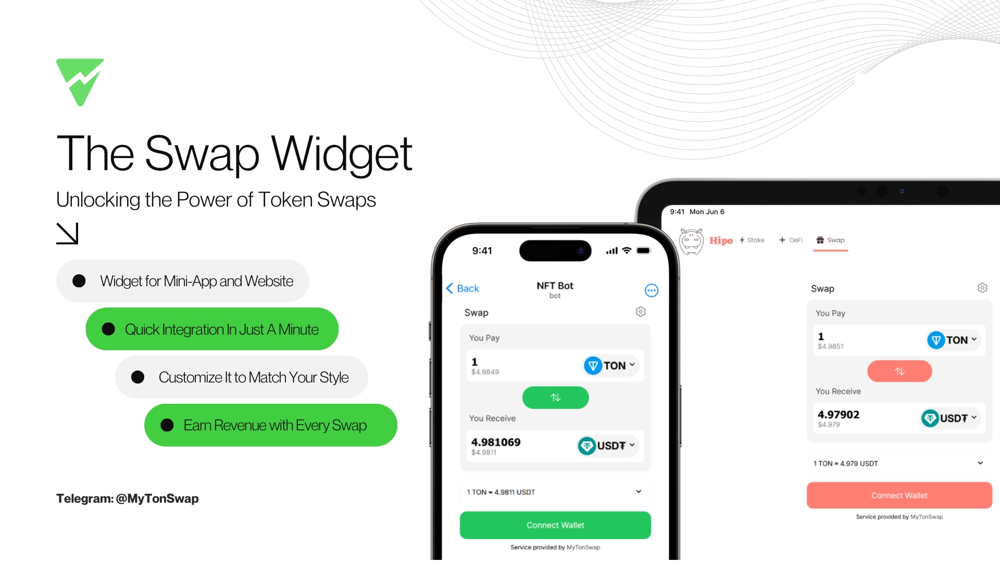

# MyTonSwap Widget

`@mytonswap/widget` is a customizable Swap component that enables developers to integrate swap functionality on the TON blockchain directly into their React applications. With this widget, users can seamlessly swap assets and connect to the TON blockchain via TonConnect.

-   📃 Docs: https://mytonswap.com/docs
-   🌐 Demo & Preview: https://widget.mytonswap.com
-   👨‍💻 Code Examples: [HTML](https://github.com/MyTonSwap/widget/tree/main/examples/html), [React](https://github.com/MyTonSwap/widget/tree/main/examples/react), [Vue](https://github.com/MyTonSwap/widget/tree/main/examples/vue)

## Features

-   **Swap Functionality**: Easily swap assets on the TON blockchain.
-   **TonConnect Integration**: Connect to the TON blockchain through TonConnect for secure and convenient user authentication.
-   **Easy Integration**: Add and configure the widget in your React project effortlessly.
-   **Responsive Design**: The widget is optimized for different devices and screen sizes.
-   **Customizable**: Adapt the widget’s appearance to match your application’s style.

## Installation

Install the widget using npm or yarn:

```bash
# Using npm
npm install @mytonswap/widget

# Using yarn
yarn add @mytonswap/widget
```

Using CDN

```html
<script
    type="module"
    src="https://cdn.jsdelivr.net/npm/@mytonswap/widget@latest/dist/cdn/mytonswap-widget.js"
></script>
```

## Usage

-   [🛟 Example in HTML](https://mytonswap.com/docs/widget/html)
-   [🛟 Example in Vue.js](https://mytonswap.com/docs/widget/vue)

After installation, you can integrate the `@mytonswap/widget` components in your React app as follows:

### Swap Component

```tsx
import "./App.css";
import { useEffect, useRef } from "react";
import { createSwap } from "@mytonswap/widget";
import { useTonConnectUI } from "@tonconnect/ui-react";

function App() {
    const [tc] = useTonConnectUI();
    const initMount = useRef(false);

    useEffect(() => {
        if (tc) {
            if (initMount) {
                return;
            }
            initMount.current = true;
            createSwap("swap-component", {
                tonConnectInstance: tc
                options: {
                    ui_preferences: {
                        primary_color: "#1456fb",
                        dark_color: "#0d1017",
                    },
                },
            });
        }
    }, [tc]);
    return (
        <div className="App">
            <div id="swap-component"></div>
        </div>
    );
}

export default App;
```

### Wallet Button

```tsx
import './App.css';
import { useEffect } from 'react';
import { createWalletProfile } from '@mytonswap/widget';
import { useTonConnectUI } from '@tonconnect/ui-react';

function App() {
    const [tc] = useTonConnectUI();
    useEffect(() => {
        if (tc) {
            createWalletProfile('wallet-button', {
                tonConnectInstance: tc,
                position: 'bottom-right',
            });
        }
    }, [tc]);
    return (
        <div className="App">
            <div id="wallet-button"></div>
        </div>
    );
}

export default App;
```

## Theme & Customization

You can fully customize the appearance of the `@mytonswap/widget` by defining css variables for widget like example down bellow.

```css
            createSwap("swap-component", {
                tonConnectInstance: tc
                options: {
                    ui_preferences: {
                        primary_color: "#1456fb", /* primary color goes */
                        dark_color: "#0d1017", /* background dark color */
                    },
                },
            });
```

## Default Tokens

You can specify default tokens to be displayed in the swap interface by passing a `defaultTokens` property to the createSwap function. This property should be an array of token objects, each containing the necessary details such as the token's address.

```tsx
function App() {
    const [tc] = useTonConnectUI();
    useEffect(() => {
        if (tc) {
            createSwap('swap-component', {
                tonConnectInstance: tc,
                options: {
                    default_pay_token:
                        'EQD4P32U10snNoIavoq6cYPTQR82ewAjO20epigrWRAup54_',
                    default_receive_token:
                        'EQD-cvR0Nz6XAyRBvbhz-abTrRC6sI5tvHvvpeQraV9UAAD7',
                },
            });
        }
    }, [tc]);
    return (
        <div className="App">
            <div id="swap-component"></div>
        </div>
    );
}
```

### Pinned tokens

You can pin specific tokens to the top of the token selection list by using the `pin_tokens` property to the createSwap function. This ensures that these tokens are always easily accessible to users.

```tsx
function App() {
    const [tc] = useTonConnectUI();
    useEffect(() => {
        if (tc) {
            createSwap('swap-component', {
                tonConnectInstance: tc,
                options: {
                    pin_tokens: [
                        'EQAAAAAAAAAAAAAAAAAAAAAAAAAAAAAAAAAAAAAAAAAAAM9c',
                        'EQD-cvR0Nz6XAyRBvbhz-abTrRC6sI5tvHvvpeQraV9UAAD7',
                    ],
                },
            });
        }
    }, [tc]);
    return (
        <div className="App">
            <div id="swap-component"></div>
        </div>
    );
}
```

### AppId

This feature allows partners to be uniquely identified when using the widget, enabling better tracking and analytics for partner-related swaps.

```tsx
function App() {
    const [tc] = useTonConnectUI();
    useEffect(() => {
        if (tc) {
            createSwap('swap-component', {
                tonConnectInstance: tc,
                options: {
                    app_id: 'your_app_id',
                },
            });
        }
    }, [tc]);
    return (
        <div className="App">
            <div id="swap-component"></div>
        </div>
    );
}
```

## Contributing

We welcome contributions to improve `@mytonswap/widget`. To contribute, follow these steps:

1. Fork the repository.
2. Create a new branch: `git checkout -b feature-name`.
3. Make your changes and commit them: `git commit -m 'Add feature'`.
4. Push to the branch: `git push origin feature-name`.
5. Submit a pull request.

### License

This project is licensed under the MIT License. See the [LICENSE](LICENSE) file for details.

Support
For issues or questions, feel free to open an issue on our [GitHub repository](https://github.com/mytonswap/widget/issues).
